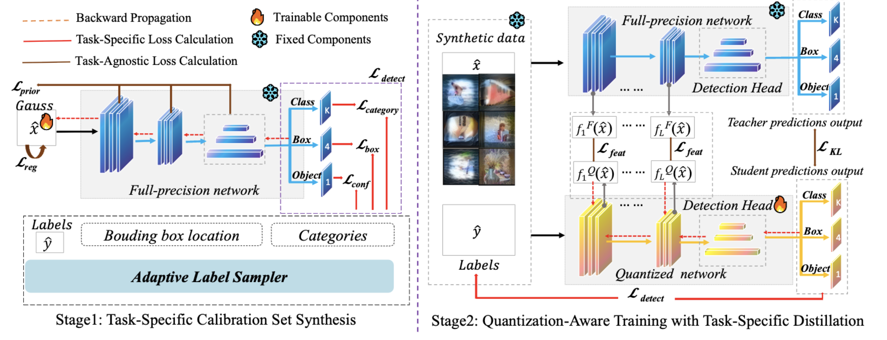

<div align="center">

# Task-Specific Zero-shot Quantization-Aware Training 				for Object Detection

[](LICENSE)
[](https://arxiv.org/abs/2507.16782)
[](https://dfq-dojo.github.io/dfq-toolkit-webpage/)

</div>

> [!NOTE]
> 📢 **Unified and Extensible!** This repo offers a **plug-and-play** *Zero-Shot QAT* framework for four major object detection backbones — **YOLOv5**, **YOLO11**, **Mask R-CNN**, and **ViT**. Ideal for **researchers** and **practitioners** looking to build on a **robust** and **versatile foundation**.
>
> 🔥 **Accepted at ICCV 2025!**
>

## Overview

We introduce a novel framework that enables task-specific zero-shot quantization of object detection networks, ensuring high performance even in the absence of real data or retraining resources.

Our contributions are threefold:

- **Diagnosing the Limitations of Task-Agnostic Calibration**:  
  We show that task-agnostic synthetic data often fails to reflect the structure of object detection tasks. Our method emphasizes the use of *task-specific* synthetic data, better aligning with real-world detection patterns.

- **Task-aware Synthetic Image Generation for Detection**:  
  We propose a new bounding-box sampling method that synthesizes object-centric images by reconstructing object category distributions, spatial layouts, and size priors—*without relying on any real data*.

- **Task-specific Quantized Network Distillation**:  
  We integrate task-aware fine-tuning into the quantized network distillation process, restoring detection performance while maintaining the compactness and efficiency of quantized models.

<p align="center">
  
</p>


## 📁 Repository Structure

This repository is organized as a monorepo containing implementations for four popular detection backbones. Each subdirectory includes code and instructions for reproducing our experiments on that architecture.

| Directory | Description |
|-----------|-------------|
| `resnet`  | Experiments using ResNet-based Mask R-CNN |
| `vit`     | Experiments using ViT-based (Transformer) Mask R-CNN |
| `yolo11`  | Experiments on the YOLOv11 series |
| `yolov5`  | Experiments on the YOLOv5 series |
| `tools`   | Utility scripts for dataset preparation |

**Note**: These submodules may require different environments or dependencies. Please refer to the `README.md` in each subdirectory for setup and usage instructions.

## 📜 License

This project includes code from [Ultralytics](https://github.com/ultralytics/ultralytics) and is therefore distributed under the **AGPL license** in compliance with their licensing terms.

## 🤝 Contribution

We welcome community contributions!  
If you find a bug or have an enhancement idea, feel free to open an issue or submit a pull request.

## 📚 Citation

If you find our work helpful, please consider citing:

```bibtex
@misc{li2025taskspecificzeroshotquantizationawaretraining,
      title={Task-Specific Zero-shot Quantization-Aware Training for Object Detection}, 
      author={Changhao Li and Xinrui Chen and Ji Wang and Kang Zhao and Jianfei Chen},
      year={2025},
      eprint={2507.16782},
      archivePrefix={arXiv},
      primaryClass={cs.CV},
      url={https://arxiv.org/abs/2507.16782}, 
}